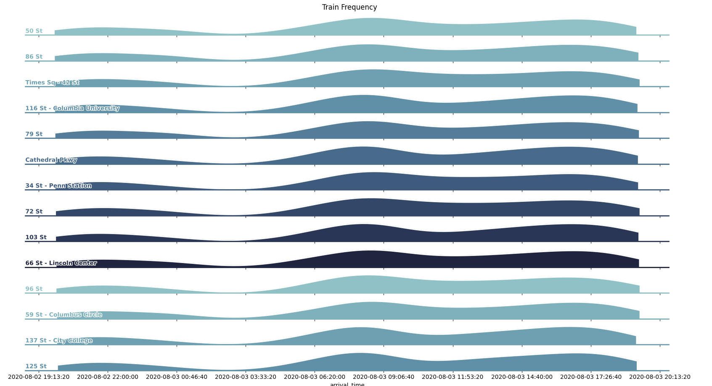

## Example Plotting Code

This section is not a part of the actual app. It includes some example plotting code.  
The code here produces plots like the one below:

*Note:*  
`stations.json` maps codes in the data files to the station names. It was taken from [here](http://mtaapi.herokuapp.com/stations)  
Source for the plot taken from [here](https://seaborn.pydata.org/examples/kde_ridgeplot)